 

### `> transmission received from beyond the event horizon_`

I'm **Michał** — a **Product Engineer** who stopped writing software the old way.

Somewhere past the event horizon, the rules change. Time bends. One hour of work turns into seven years of output. That's what it feels like to combine **product thinking**, **real technical depth**, and **a crew of AI coding agents** — not a tool upgrade, but a *new dimension of work*.

I don't just ship features. I chart galaxies nobody has mapped yet: deciding **what** is worth building and **why**, knowing **how** it works under the hood, and commanding agents that turn intent into running code at warp speed.

  

<table>
<tr>
<td width="33%" valign="top">

#### 🪐 Product gravity
I start from the user and the outcome, not the ticket. Every line of code has to earn its orbit.

</td>
<td width="33%" valign="top">

#### 🛰️ Technical depth
React, TypeScript and the whole frontend universe — deep enough to know when an agent is right and when it's hallucinating a wormhole.

</td>
<td width="33%" valign="top">

#### 🚀 Agent propulsion
Claude Code & Codex as my crew. I architect, review and steer; they execute. Ideas → shipped products, faster than light.

</td>
</tr>
</table>

  

